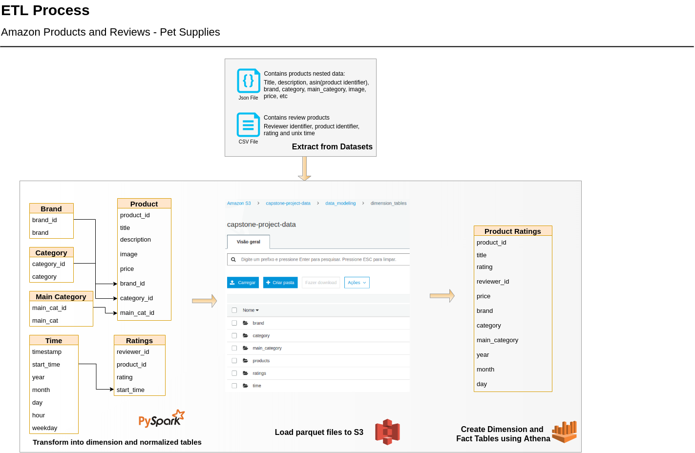
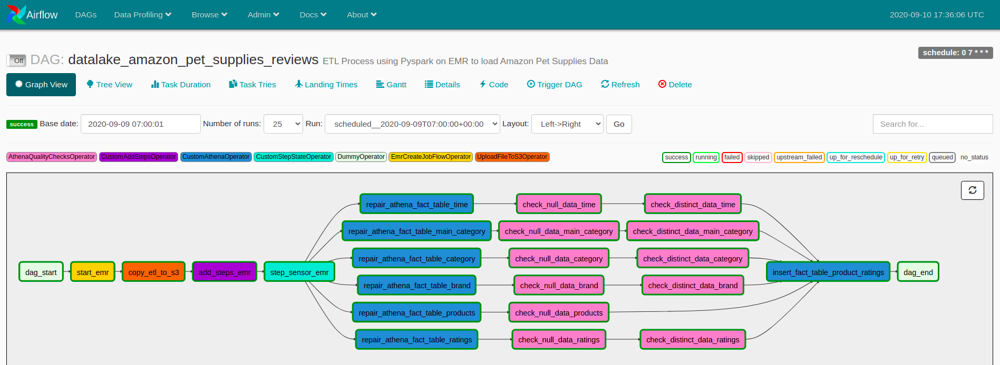

# Capstone Project
## Amazon Pet Supplies Datalake with Spark  
<br/>

### 1. Project Scope
<div style="text-align: justify"> One of the Amazon focuses is the e-commerce. As well as being an online retailer, Amazon allows for individuals and business to sell and display products for sale online. 
There are many categories of products, but this project is referring to <b>Pet Supplies</b>.  

Amazon needs to keep track of information about pet products in the catalog, their descriptions, prices, ratings and how all this data can become something valueble to decision making. As a good example of this, we have the performance of brands that should be analyzed: based on product data and ratings, which brands that perform better or worse? So the company can always work with the best products, have their customers satisfied and improve their services. </div>


### 2. Datasets
Both of datasets are available on: 
<br/>
http://deepyeti.ucsd.edu/jianmo/amazon/index.html
<br/>
https://nijianmo.github.io/amazon/index.html


- CSV Dataset: ratings of products (+1.2M rows).
Example:
```
+--------------+----------+------+----------+
|   reviewer_id|product_id|rating| timestamp|
+--------------+----------+------+----------+
|A3PG0KS1YE8MR4|0615553605|   5.0|1354838400|
|A363P047LR5XI6|0615553605|   4.0|1373932800|
```

- Json Daset: has all products metadata (+200K nested objects). Example:
```
{"category": ["Pet Supplies", "Dogs"], "tech1": "", "description": ["Know exactly what your dog is eating with 101 Dog Treats. We provide you with the recipes and the cookie cutters and the rest is up to you.", "", ""], "fit": "", "title": "Pet Qwerks Treat Cookbook with Cutters", "also_buy": [], "image": ["https://images-na.ssl-images-amazon.com/images/I/41yroPoJJoL._SS40_.jpg", "https://images-na.ssl-images-amazon.com/images/I/41n5wUvfhsL._SS40_.jpg"], "tech2": "", "brand": "Pet Qwerks", "feature": ["Recipe book", "Cookie cutters", "Indoor/outdoor use"], "rank": "190,234 in Pet Supplies (", "also_view": ["B075DYQ1PH", "1604334657", "1604336919", "1630260436", "B072KFT7YK", "B01GVUYPL2", "B0000VLP5S", "B074SL7GN5"], "main_cat": "Pet Supplies", "similar_item": "", "date": "", "price": "$7.86", "asin": "0615553605"}
```

### 3. End use cases 
<div style="text-align: justify">
The project's purpose and its end use case is a datalake filled by an Airflow pipeline running on schedule, extracting all raw data coming from json and csv sources using PySpark on AWS EMR, transformed into files on AWS S3, in dimension and fact tables on AWS Athena. As a fact table, this can also be uses as analytics table to answer business questions.
</div>
<br/>

### 4. Choice of Technologies
- Airflow: great tool to orchestrate pipelines on schedule
- AWS EMR: helps processing vast amounts of data usings Apache Spark
- AWS S3: object storage service is used to save parquet files
- AWS Athena: can query S3 data using SQL, so we can have a Datalake
- AWS Glue: was used to create for the first time, dimension tables on Athena, with automatic crawlers.

### 5. Exploring and Assessing the Data
(All explorings and assessments were done and commented in ```dag/etl.py``` )

### 6. Data Modeling and ETL Process


A Star Schema was created for queries with both datasets. 
This data model was chosen to optimize queries with dimension tables normalized.

- **Dimension Tables**:

   - **brand**: brands of products. Columns: *brand_id*, *brand*.

   - **category**: categories of products. Columns: *category_id*, *category*.

   - **main_category**: main categorys of products. Columns: *main_cat_id*, *main_cat*.

   - **time**: timestamps of records in ratings. Columns: *timestamp*, *start_time*, *year*, *month*, *day*, *hour*, *weekday*.

   - **product**: normalized product table. Columns: *product_id*, *title*, *description*, *image*, *price*, *brand_id*, *category_id*, *main_cat_id*.

   - **ratings**: products ratings. Columns: *reviewer_id*, *product_id*, *start_time*.

 - **Fact Table**: 

   - **product_ratings**: records in products joined with ratings. Columns: *product_id*, *title*, *reviewer_id*, *price*, *brand*, *category*, *main_category*, *year*, *month*, *day*.

### 7. Airflow Pipeline


Here we have the pipeline used to do the ETL process of our Amazon Pet Supplies Datalake.
Its schedule is everyday at 7am(UTC), so data can be extracted on a daily basis.

- Tasks *dag_start* and *dag_end* were used as ``` DummyOperators ``` to indicate DAG's start and end;
- *start_emr* starts a specified job flow(cluster) with all settings on EMR;
- *copy_etl_to_s3* copies ```etl.py``` to a given S3 bucket and prefix, so EMR can run based on this path;
- *add_steps_emr* runs ``` spark-submit ``` with the etl on S3:
    - each execution of this task in Airflow, creates the respective partition folder on S3, gua
- *step_sensor_emr* checks if step submitted to EMR is ready or failed:
    - Failed, raises error and terminates cluster. 
    - Running, waits until next status.
    - Completed, succeed and terminates cluster.
- *repair_table* runs ``` MSCK REPAIR TABLE ``` to dimension tables in athena to add s3 partition of each execution date that runs
- *check_null_data* is the first data quality check of null values on ids
- *check_distinct_data* is the second data quality check of distinct values
- *insert_fact_table* runs only if all dimension data quality is write. Inserts into **product_ratings** fact table.

### 8. Problem under following cenarios:
- If the data was increased by 100x: check types of nodes that EMR can provide and probably increase the cluster if necessary;
- If the pipelines were run on a daily basis by 7am: it's already running;
- If the database needed to be accessed by 100+ people: AWS Redshift with Spectrum might help in this case because Spectrum allows Redshift to read Athena schemas(each person should have her/his access to Redshift and decrease the possibility of AWS Account creation for each one).